- activation

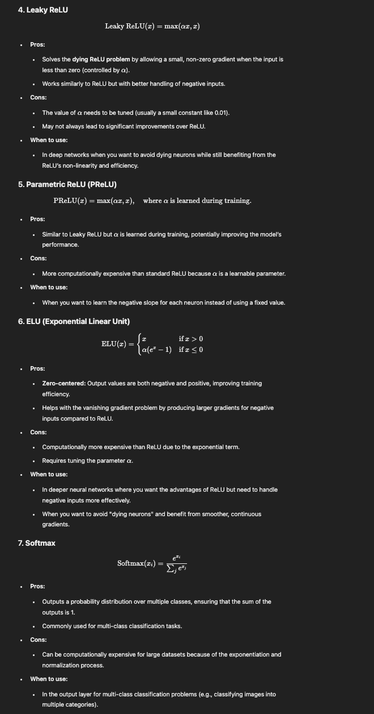
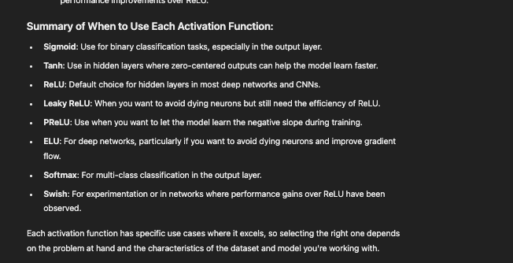
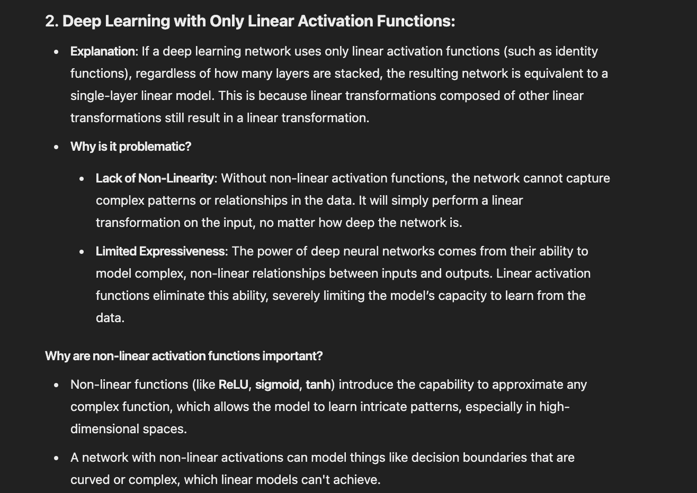
- loss

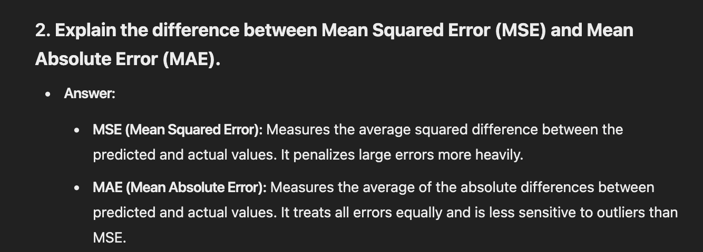
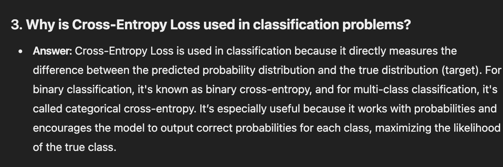

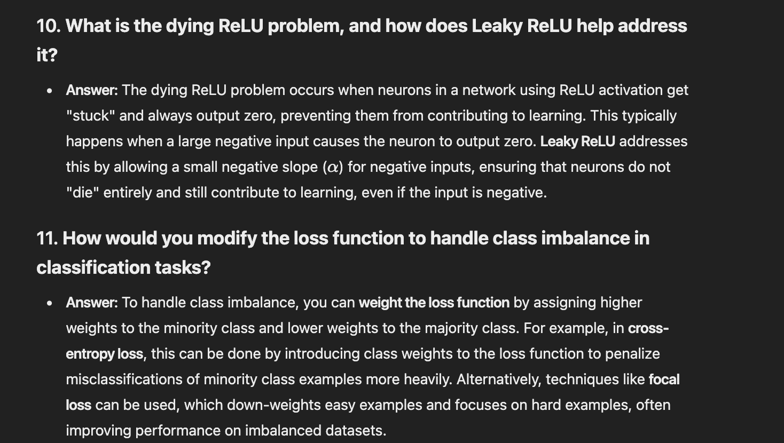

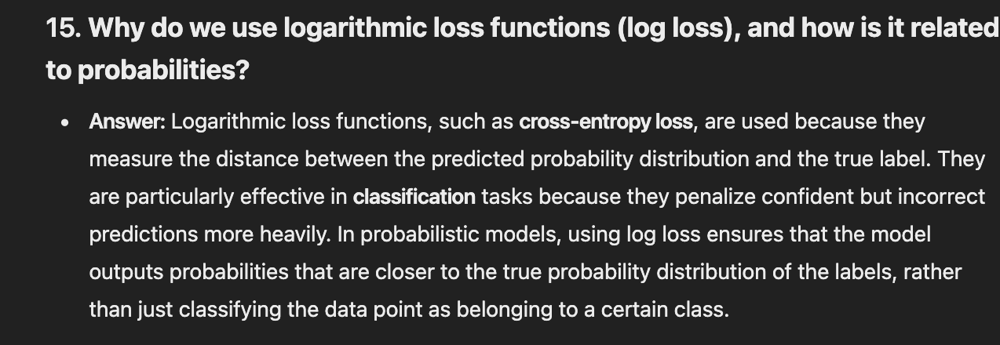
- optimization

    - convex
    - is mse convex loss
    - gradient descent
    
    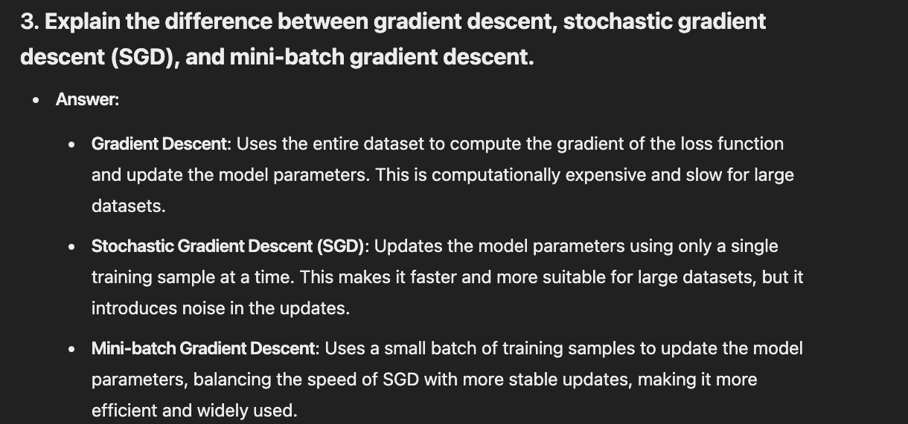
    
    
    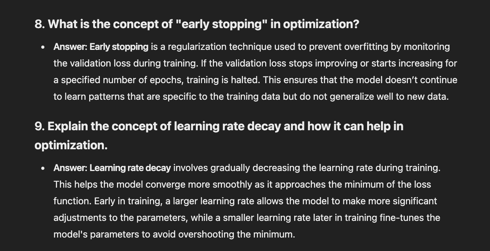
    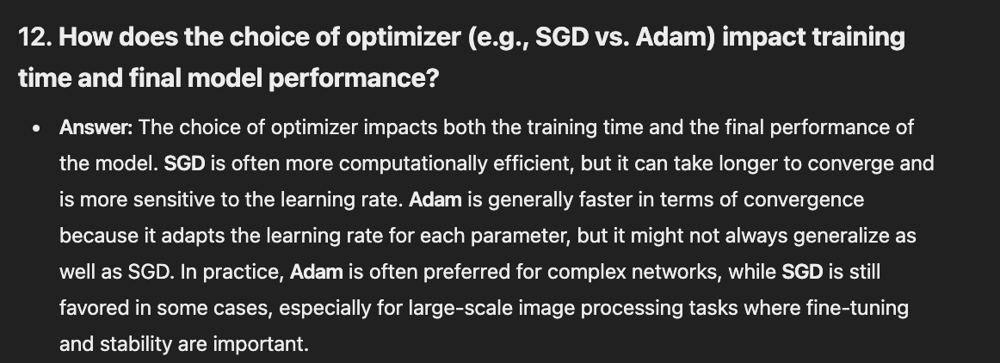
    
    
    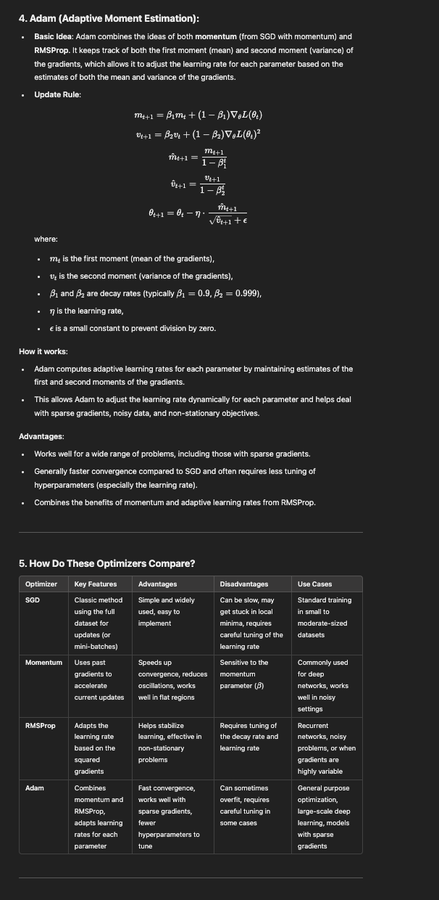
    
    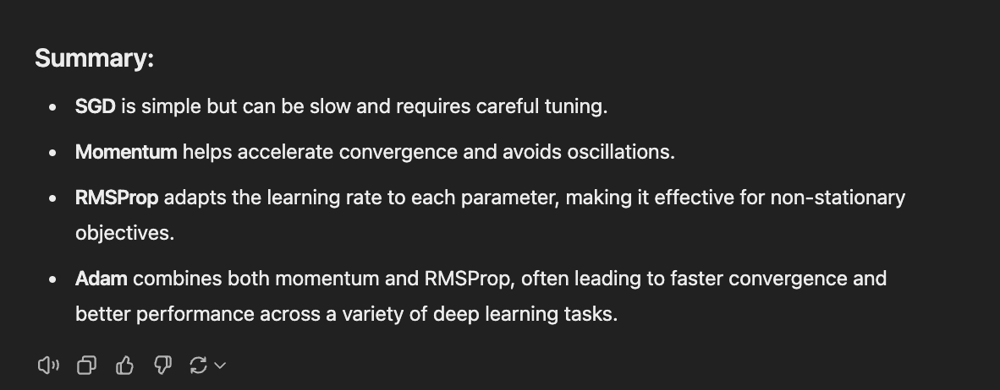
    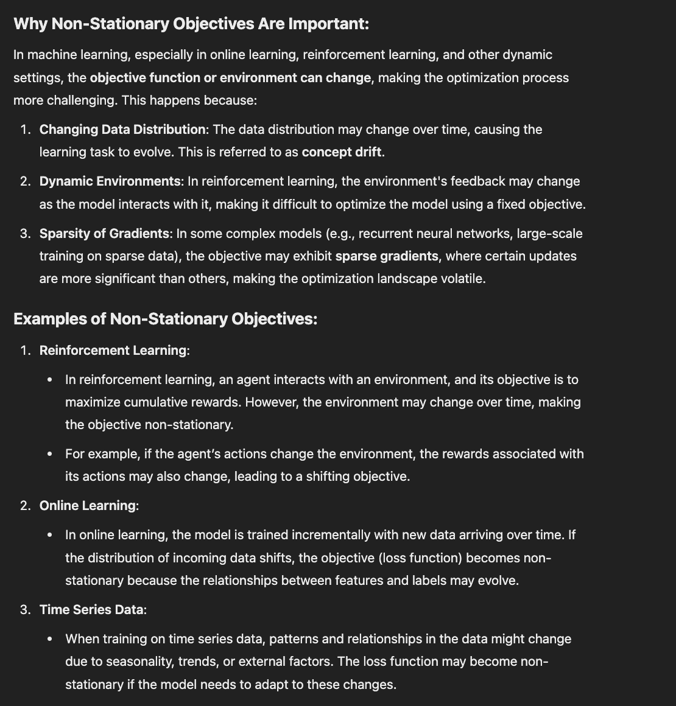
    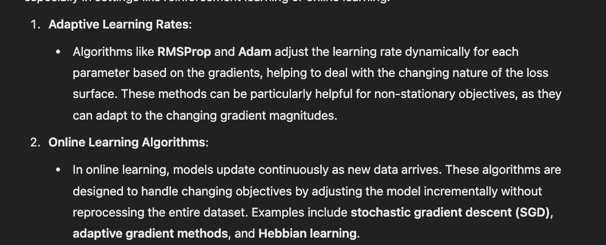
- vanishing and exploding gradients

- backprop and lr

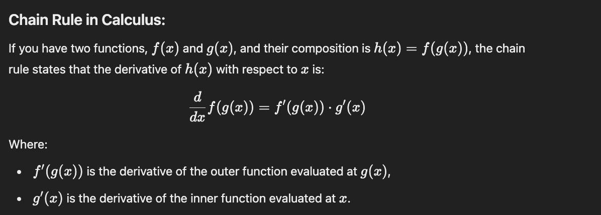

- dropout

- batch norm

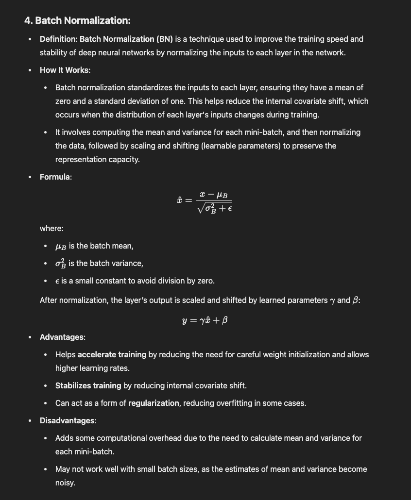

- layer norm 

- rnn, lstm, gru, transformer
- auto encoder

- how did you choose the layers, units, act functions and why
- preprocess ts how did you do it
- nhits nbeats
- weights

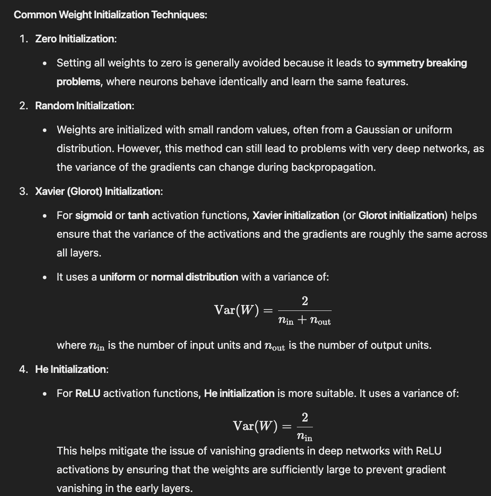
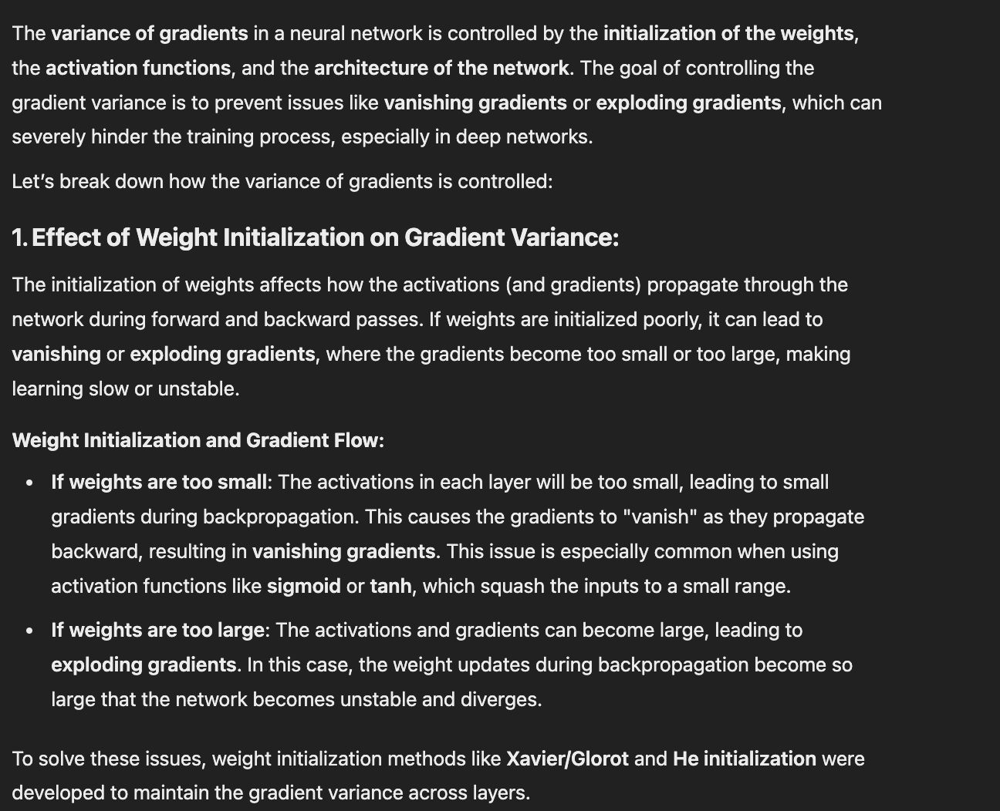
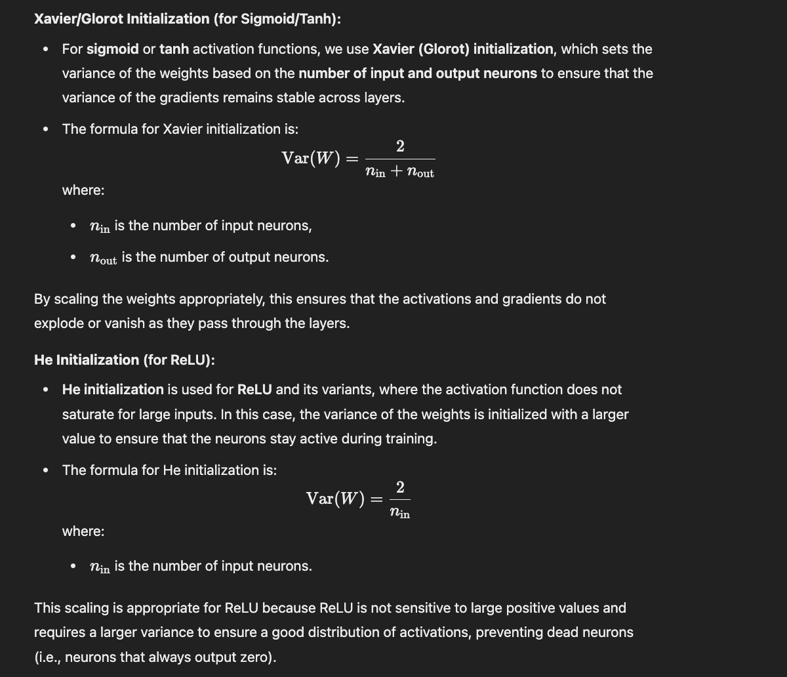

