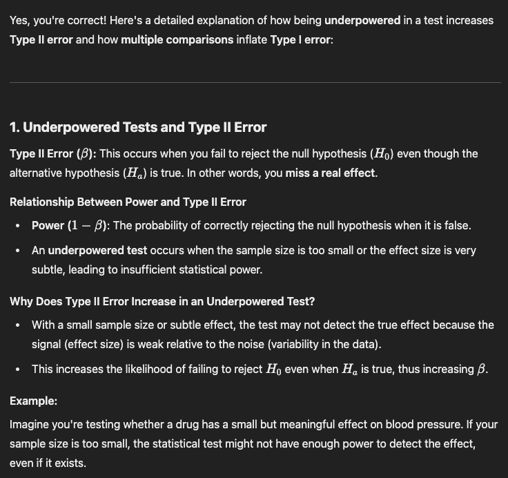
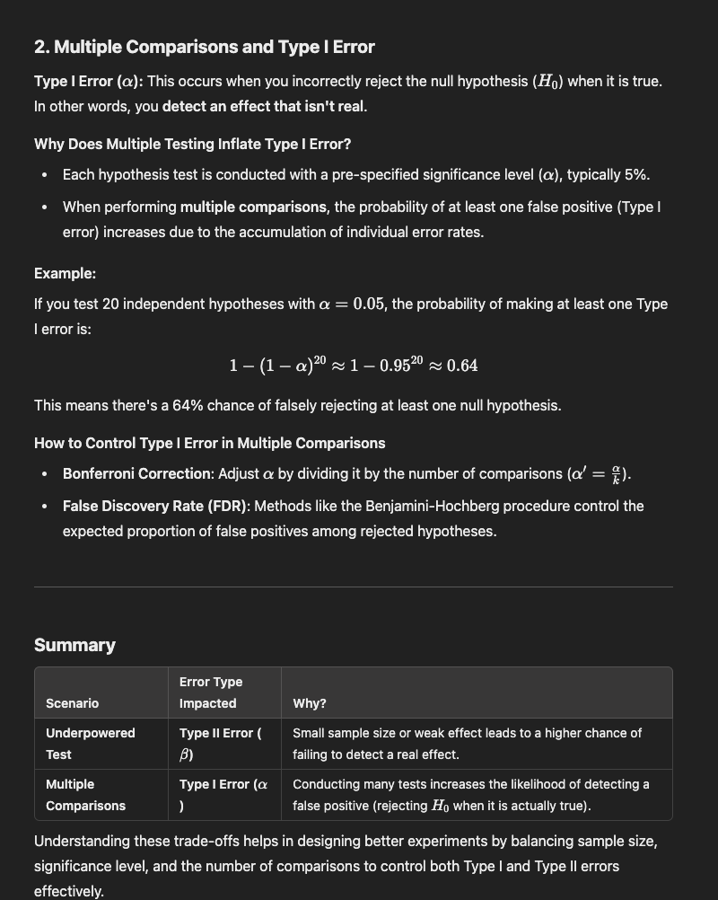
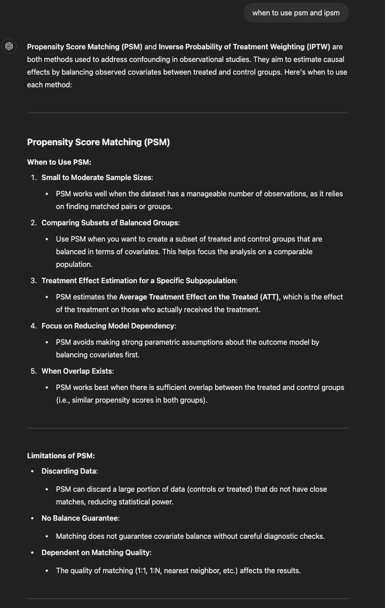
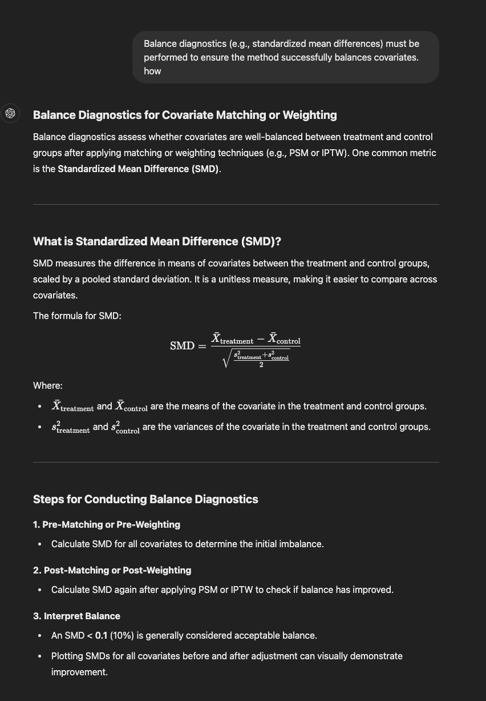
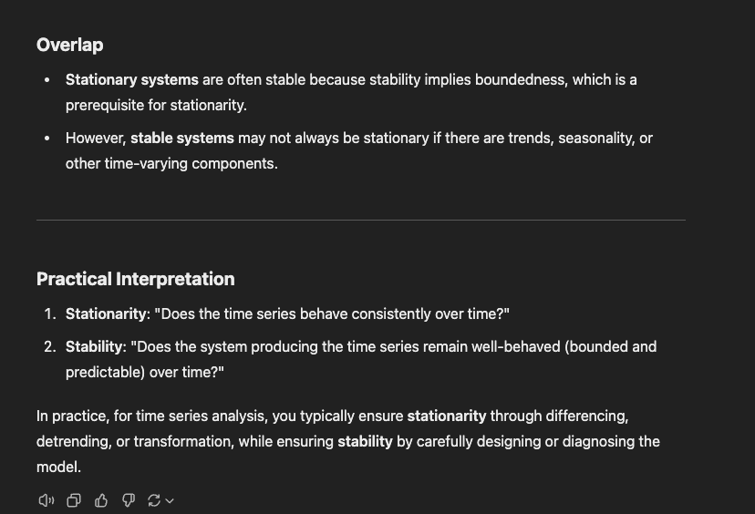
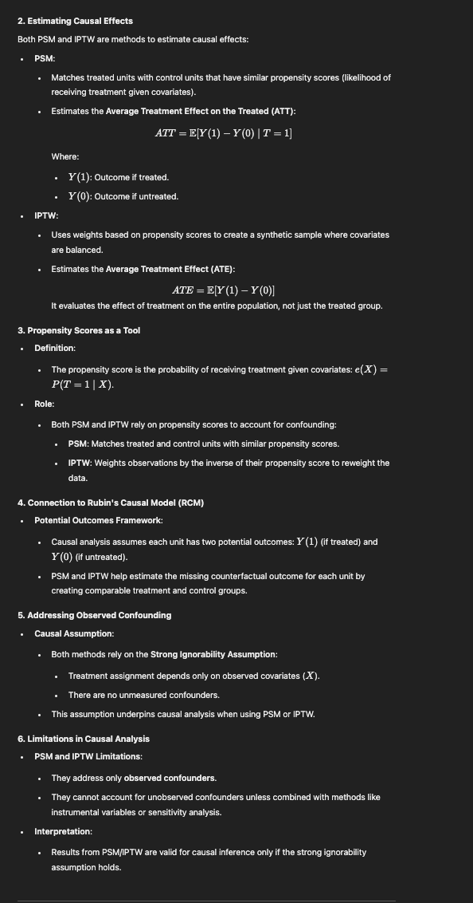
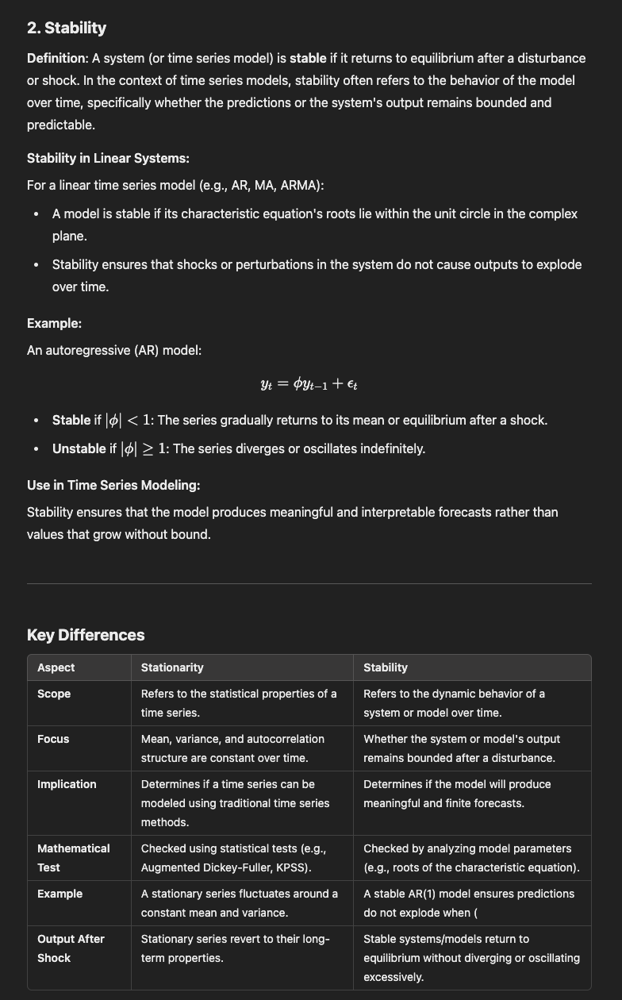
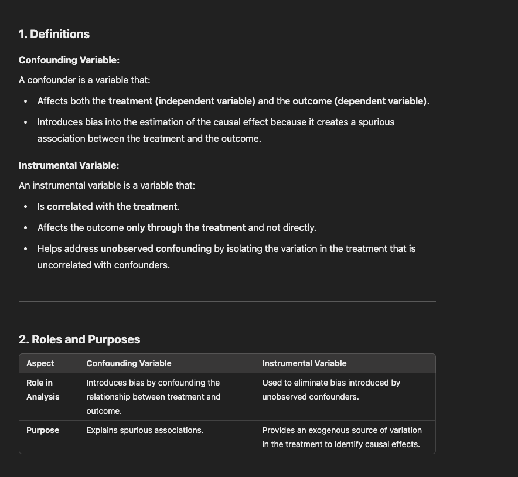

1. prob cheat sheet
    imp concepts

    
    

    - Kurtosis - measures shape of distribution - especially the tails, are thery heavire or lighter than normal. normal dist has kurtosis = 0

    - var 
        population has var which indicates avg spread
        var = (x-mu)^2/n = sigma^2

        var of estimator measures the variability of an estimator across different samples from the population.
        var = E(Xhat^2) - (E(Xhat))^2 = E((Xhat-E(Xhat))^2) 

        
    - bias = X- E(Xhat)
        In general, a population does not have bias, because the population represents the entire set of data or observations, encompassing all possible values for a parameter. Bias typically arises when working with samples, estimators, or models, which are imperfect representations of the population.

        The bias quantifies how far the expected value of the estimator is from the true population parameter.

        

        

    - LLN - as n tends to inifity, sample mean will tend to pop mean
    assumption - x are iid rv with constant mean mu

    - CLT - sum of iid rvs will tend to normal as n tends to infinity
    It states that, given a sufficiently large sample size from a population with any distribution, the sampling distribution of the sample mean will approximate a normal distribution, regardless of the original population's distribution.

    

    - distributions

    

2. sample statistics

    

    - Statistic is an estimate of the parameter.
    - sample bias

    

    - sample error

    

    - sampling variability

    

    - standard err and stand dist diff

     | 

    

    - intervals
    

    

    

    

    

3. Probability

    - odds

    

    - prior, posterior, likelihood, marginal

    

4. Hyp tests

- explain p val to non tech audience

- errs

- power

- Hyp testing

    - t dist has fatter tails compared to normal

- pitfalls of experimentation 

- sampling and sampling bias

- metrics

    - r^2, adj r^2
    - f stat
    - auc roc
    - pre recall
    - entropy
    - gini
    - silhouette score

- loss
    - hinge loss
    - log loss
    - mse
    -

- causal inference

